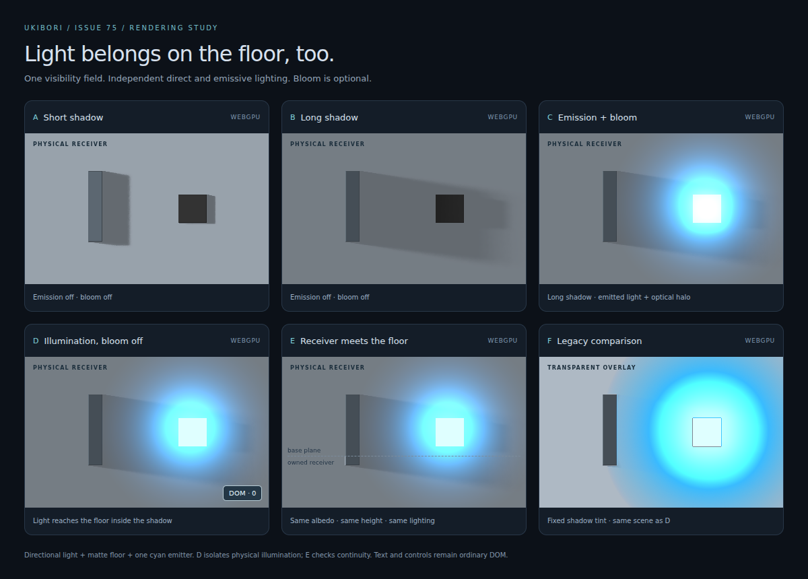
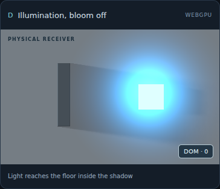

# Issue #75 — Physical base-plane receiver

Issue: https://github.com/MasafumiYamaguchi/Ukibori/issues/75

Base: `d3e8b65a05ebd54616114841977e6080b96cc9bf` (`master`).

## Root cause and previous data flow

An owned pixel has an `objectId` other than `NO_OWNER`. Uncovered pixels keep
`NO_OWNER`; there is no synthetic floor surface or change to ownership ordering.

The CPU lighting pass already shaded these pixels using `BASE_MATERIAL`
(linear RGB 0.6, roughness 0.5, metallic 0). WebGPU had the equivalent fixed
material in `lighting-pass-wgsl.ts`. Both applied primary shadow visibility
only to direct light. The color was then discarded by DOM composition:

1. `ukibori-dom/compositor.ts` calls `renderer/gpu/composite.ts`.
2. Owned pixels keep their opaque renderer color.
3. Unowned pixels become a translucent `shadowColor` (default RGB 12/16/28)
   with alpha `shadowAlpha * (1 - visibility)` (default alpha 0.3).
4. The actual background is painted by CSS, outside renderer state.
5. CPU `emissive-effects.ts` and GPU `emissive-effects-wgsl.ts` add spill to
   the shadow tint, with alpha bounded by the largest output channel.
6. The bloom vertical/composition stage repeats that special tint handling.

The normal GPU presentation shader mirrors the CPU compositor. When effects
are enabled, `precomposited` presents the already premultiplied effect output.
CPU converts this effect output to straight alpha at the Canvas2D boundary.
Thus fixing just `compositor.ts` would leave both GPU and bloom paths wrong.

The old model is retained only when no physical floor is explicitly requested,
so existing transparent/gradient page integrations keep their contract.

## Explicit color and extent contract

```tsx
const floorColor = "#aeb9c4";

<Ukibori
  basePlaneColor={floorColor}
  style={{ background: floorColor, overflow: "hidden" }}
  compositing={{ emissive: { illumination: { radius: 140, intensity: 2 } } }}
>
  {/* Ordinary DOM and registered Surface elements */}
</Ukibori>
```

- React: `basePlaneColor?: string`.
- DOM: the same constructor option and `setBasePlaneColor(color | undefined)`.
- Supported input: opaque sRGB `#rgb`, `#rrggbb`, `rgb()` and `rgba()`.
  Unsupported/transparent colors throw explicitly; use `undefined` to restore
  the legacy transparent mode. Arbitrary inherited CSS, variables, gradients,
  background images and wide-gamut paint reconstruction are not inferred.
- sRGB input is converted **once at the DOM boundary** into canonical f32 linear
  reflectance. Renderer-only users supply `BasePlaneOptions.baseColor` in linear
  space, through `GpuScenePipeline`'s `compositeOptions.basePlane`, or the same
  option to CPU lighting and compositing helpers.
- The physical material is fixed: roughness 0.9, metallic 0, IOR 1.5, no emission;
  its shading normal is `(0, 0, 1)`. The existing normal and geometry buffers
  themselves are not rewritten.
- The DOM physical domain is the stage's visible padding box, rather than the
  surfaces' bounding rectangle plus a margin. An empty stage can render a floor.
  Use a stage sized to contain the intended physical scene. Physical pixels and
  effect spill outside that domain are clipped by the render extent; `margin`
  applies to legacy mode. Rounded clipping continues to belong to CSS.
- The stage CSS background remains app-owned (including before hydration or
  without enhancement); the physical overlay supplies the lit visual result.
  Its color is albedo, so it is **not** guaranteed to look like the unlit CSS
  swatch. No scene-wide ambient/exposure compensation was added.

## Final lighting and presentation order

For the physical floor and an equivalent owned matte receiver:

```text
L0 = (baseColor * ambient + directBRDF * NdotL * lightIntensity
      * lightColor * visibility + environmentResponse) * exposure
C0 = encode_sRGB(clamp(L0))
C1 = encode_sRGB(decode_sRGB(C0) + baseColor * emissiveIncident * exposure)
C2 = encode_sRGB(decode_sRGB(C1) + emissionBloom)   [only when enabled]
alpha = 1
```

The implementation deliberately preserves the existing owned-surface RGBA8
boundary between lighting and effects, including its quantization/clipping.
It does not introduce an HDR-pipeline or tone-mapper redesign. Internal
output decoding for the existing effects is distinct from input-albedo decoding.

`visibility` still belongs solely to primary direct light. Neither emissive
illumination nor bloom changes it. Surface self-emission is unchanged. Ambient
and environment retain their existing meaning. Emissive incident light remains
the existing visible-source screen-space approximation with four height checks;
this change does not add GI or redesign emitter occlusion.

Physical pixels bypass the fixed shadow tint in **all three paths**: ordinary
presentation, illumination/composition, and bloom composition. Bloom still uses
exposed HDR material emission as input, not the floor's reflected light. Disabling
bloom retains emissive illumination on the floor.

## DOM and retained rendering

The existing stage-local, negative-z-index canvas remains below DOM content,
with `pointer-events: none`, `aria-hidden`, and no focusability. No semantic DOM
replacement, event interception, position change, or SSR output change is added.

- Stage resize is observed; stage position/extent is checked before a retained
  skip. A changed floor region remeasures baked and dynamic surfaces so their
  cached document coordinates cannot drift from the new origin. DPR and scroll
  updates use the existing coordinate/lifecycle path.
- A base-color change is part of the **lighting** fingerprint as well as
  composition. It runs lighting + presentation; height/normal/shadow stay retained.
- Emission and light-intensity edits retain geometry and shadows.
- Geometry plus a base-color change forces full lighting, so global floor color
  cannot remain stale outside a dirty band.
- Geometry-only partial updates still recompute effect spill over the full field.
- Static frames issue zero dispatches. `present()` reuses the retained image.

## Reproduction and screenshots

Run `npm run dev -w demo`, then open `/base-plane-debug.html`.
`?backend=cpu` and `?backend=webgpu` select an explicit backend.

| Case | Scene |
| --- | --- |
| A | Short shadow, emission off |
| B | Long shadow, emission off |
| C | Long shadow, emission and bloom on |
| D | Long shadow, emission on, bloom off |
| E | Same as D with a same-material, zero-height owned receiver adjoining the floor |
| F | Same scene under the legacy transparent composition contract |





`base-plane-before.png` is captured from the base commit with the identical
fixture added only for inspection. `base-plane-bloom-off-cpu.png` exercises the
CPU DOM output. The ordinary emissive demo also opts into its known solid
`#151c22` floor. The main playground's arbitrary CSS gradient remains legacy.

## Validation and performance

See [validation.md](validation.md), [parity.json](parity.json),
[browser-validation.json](browser-validation.json), and
[performance.json](performance.json) for results and environment details.

The new parity harness is included in the existing real-WebGPU golden gate.
It can also be run with a native Dawn adapter using
`npm run test:base-plane:webgpu -w ukibori-renderer`.
`UKIBORI_WEBGPU_MODULE` selects an externally installed `webgpu` package.

`node tools/verify-base-plane-browser.mjs` exercises browser rendering, DOM
interaction, stage resize, DPR and scroll, and captures the screenshots.
It uses an optional Playwright installation (`UKIBORI_PLAYWRIGHT_MODULE`) and
Chrome (`CHROME_PATH`). To capture a true before image, set
`UKIBORI_BASELINE_ROOT` to a separate checkout containing this same demo fixture.
Only restricted test hosts should set `WEBGPU_CHROME_NO_SANDBOX=1`.

`node packages/renderer/scripts/bench-base-plane.mjs` compares warm, same-extent
frames; `UKIBORI_BASELINE_MODULE` can point to a separately built master bundle.
Set `UKIBORI_BENCH_OUTPUT` to write the JSON report.

No extra fullscreen pass, per-pixel buffer, texture, or normal-rendering GPU→CPU
readback is introduced. Lighting uniforms grow 16→32 bytes; illumination and
bloom uniforms each grow 64→80 bytes. Presentation reuses its existing 32-byte
uniform. Stage-wide coverage can change total rendered pixels; this must be
considered separately from the same-extent measurements.

## Remaining scope limits

This is an explicit, uniform, opaque floor contract. General floor materials,
textured backgrounds, arbitrary CSS paint reconstruction, global illumination,
new shadow algorithms and bloom/tone-mapping redesigns are outside Issue #75.
Real hardware GPU speed remains a separate validation requirement; software
WebGPU correctness is not evidence of hardware performance. Stop for review.
